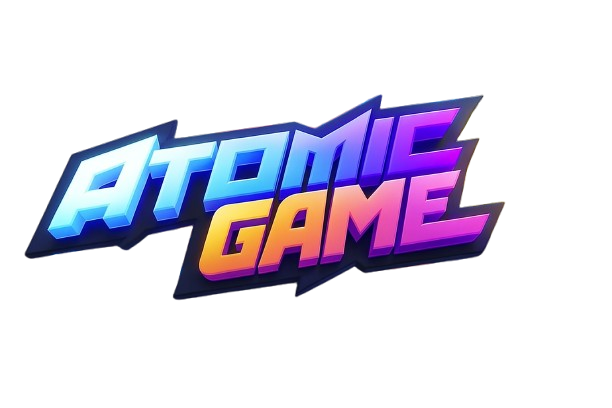

# 🎮 Atomic game - Atomic games

<div align="center">



**La plateforme ultime pour découvrir et télécharger les meilleurs jeux vidéo gratuits**

[](https://nextjs.org/)
[](https://www.typescriptlang.org/)
[](https://reactjs.org/)
[](https://tailwindcss.com/)
[](https://www.framer.com/motion/)

[](https://vercel.com/)
[](LICENSE)
[](CONTRIBUTING.md)

[🚀 Demo Live](#) • [📖 Documentation](#) • [🐛 Report Bug](#) • [💡 Request Feature](#)

</div>

---

## ✨ Fonctionnalités

### 🎯 **Navigation & Filtrage**
- 🔍 **Recherche intelligente** avec suggestions en temps réel
- 🏷️ **Filtrage par catégories** (RPG, Action, FPS, MOBA, etc.)
- 🖥️ **Filtrage par plateforme** (PC, Navigateur)
- 🆕 **Section Nouveautés** avec tri par date de sortie
- 🔗 **Navigation par URL** avec support des hashtags (#search)

### 🎨 **Interface Utilisateur**
- 🌙 **Design moderne** avec thème sombre
- 📱 **Responsive design** adaptatif mobile/desktop
- ✨ **Animations fluides** avec Framer Motion
- 🎭 **Skeletons de chargement** élégants
- 🖼️ **Lazy loading** des images avec effet de flou progressif

### 🎮 **Gestion des Jeux**
- 📋 **Liste complète** de jeux gratuits via l'API FreeToGame
- 🔍 **Détails complets** de chaque jeu (description, screenshots, etc.)
- 🖼️ **Galerie d'images** avec lightbox interactif
- 🎯 **Jeux similaires** et recommandations
- ⭐ **Système de notation** et informations détaillées

---

## 🛠️ Technologies Utilisées

### **Frontend**
- **Next.js 14.2.16** - Framework React avec SSR/SSG
- **TypeScript** - Typage statique pour JavaScript
- **React 18** - Bibliothèque UI avec hooks modernes
- **Tailwind CSS** - Framework CSS utility-first

### **UI/UX**
- **Radix UI** - Composants accessibles et personnalisables
- **Framer Motion** - Animations et transitions fluides
- **Lucide React** - Icônes modernes et cohérentes

### **État & Données**
- **React Context** - Gestion d'état global pour les filtres
- **Custom Hooks** - Logique réutilisable pour l'API
- **FreeToGame API** - Base de données de jeux gratuits

---

## 🚀 Installation & Démarrage

### **Prérequis**
- Node.js 18+ 
- npm ou yarn ou pnpm

### **Installation**

```bash
# Cloner le repository
git clone https://github.com/votre-username/game-square.git
cd game-square

# Installer les dépendances
npm install
# ou
yarn install
# ou
pnpm install
```

### **Développement**

```bash
# Démarrer le serveur de développement
npm run dev
# ou
yarn dev
# ou
pnpm dev
```

Ouvrez [http://localhost:3000](http://localhost:3000) dans votre navigateur.

### **Build de Production**

```bash
# Construire l'application
npm run build
npm run start
```

---

## 📁 Structure du Projet

```
Game-square/
├── 📁 app/                    # App Router (Next.js 13+)
│   ├── 📁 api/               # Routes API
│   ├── 📁 game/[id]/         # Pages dynamiques des jeux
│   ├── 📄 layout.tsx         # Layout principal
│   ├── 📄 page.tsx           # Page d'accueil
│   └── 📄 globals.css        # Styles globaux
├── 📁 components/            # Composants React
│   ├── 📁 ui/               # Composants UI réutilisables
│   ├── 📄 header.tsx        # En-tête avec navigation
│   ├── 📄 footer.tsx        # Pied de page
│   └── 📄 games-list.tsx    # Liste des jeux
├── 📁 contexts/             # Contextes React
│   └── 📄 FilterContext.tsx # Gestion des filtres globaux
├── 📁 hooks/                # Hooks personnalisés
│   └── 📄 useGames.ts       # Hook pour l'API des jeux
├── 📁 lib/                  # Utilitaires et configuration
│   ├── 📄 api.ts           # Client API FreeToGame
│   ├── 📄 types.ts         # Types TypeScript
│   └── 📄 utils.ts         # Fonctions utilitaires
└── 📁 public/               # Assets statiques
```

---

## 🤝 Contribution

Les contributions sont les bienvenues ! Voici comment contribuer :

1. **Fork** le projet
2. **Créez** votre branche feature (`git checkout -b feature/AmazingFeature`)
3. **Committez** vos changements (`git commit -m 'Add some AmazingFeature'`)
4. **Push** vers la branche (`git push origin feature/AmazingFeature`)
5. **Ouvrez** une Pull Request

---

## 📄 License

Ce projet est sous licence MIT. Voir le fichier [LICENSE](LICENSE) pour plus de détails.

---

## 👨‍💻 Auteur

**Atomic games Team**

- 🌐 Website: [atomic-games.com](#)
- 📧 Email: contact@atomic-games.com
- 🐙 GitHub: [@atomic-games](#)

---

## 🙏 Remerciements

- [FreeToGame API](https://www.freetogame.com/api-doc) pour la base de données de jeux
- [Radix UI](https://www.radix-ui.com/) pour les composants accessibles
- [Tailwind CSS](https://tailwindcss.com/) pour le framework CSS
- [Framer Motion](https://www.framer.com/motion/) pour les animations

---

<div align="center">

**⭐ N'oubliez pas de donner une étoile si ce projet vous a aidé ! ⭐**

Made with ❤️ by Atomic games Team

</div>